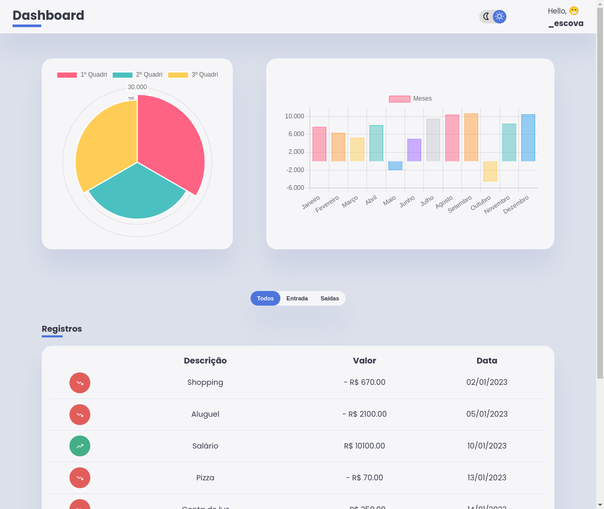

# Dashboard Financeiro - Gráficos Dinâmicos com Chart.js

*Visualização da dashboard*

## Visão Geral
Este projeto é um **dashboard financeiro** que exibe registros de entradas e saídas financeiras através de **gráficos dinâmicos** e uma tabela interativa. O objetivo é fornecer uma interface intuitiva para visualizar dados financeiros ao longo de meses e quadrimestres, com a capacidade de alternar entre **tema claro** e **tema escuro**.
- **Autor:** Wellington M Santos  
- **Data:** Novembro 2024  
- **Repositório:** https://github.com/esscova/dashboard-gastos-pessoais

## Funcionalidades
- **Gráfico de Barras**: Exibe a diferença entre entradas e saídas financeiras por mês.
- **Gráfico Polar**: Agrupa os dados para mostrar o comportamento financeiro de cada quadrimestre.
- **Tabela de Registros**: Mostra detalhes sobre cada transação (entrada/saída), incluindo a descrição, valor e data.
- **Filtro de Transações**: Botões que permitem filtrar entre **todas as transações**, **entradas** ou **saídas**.
- **Alternância de Tema**: Permite alternar entre tema claro e escuro, ajustando automaticamente o estilo dos gráficos.

## Tecnologias Utilizadas
- **HTML**: Estrutura da interface do usuário.
- **CSS**: Estilização da página, com suporte a temas claro e escuro.
- **JavaScript (ES6+)**: Manipulação dos dados, criação e estilização dinâmica dos gráficos com a biblioteca `Chart.js`.
- **Chart.js**: Biblioteca para criação de gráficos dinâmicos.
  
## Como Funciona
1. O projeto obtém dados financeiros a partir de um arquivo `data.json`.
2. Esses dados são manipulados para calcular as diferenças entre entradas e saídas e são exibidos nos gráficos e na tabela.
3. A interface permite que o usuário alterne entre temas claro e escuro, e os gráficos são automaticamente destruidos e recriados para se adequar ao tema ativo.

## Como usar
Para rodar a aplicação localmente, você precisará de um servidor local, pois o navegador não permite carregar arquivos locais (como `data.json`) diretamente por questões de segurança. Siga os passos abaixo:

1. Clone o repositório
    ```bash
    git clone https://github.com/esscova/dashboard-gastos-pessoais.git
    ```
2. Navegue até o diretório do projeto
    ```bash
    cd dashboard-gastos-pessoais
    ```
3. Rode um servidor local:

    Escolha uma das opções abaixo para rodar a aplicação em um servidor local:

    Opção 1: Usando Python (recomendado para simplicidade)
    Se você tem Python instalado, execute o seguinte comando no terminal:
    ```bash

    python -m http.server 8000
    ```
    Em seguida, abra o navegador e acesse: http://localhost:8000

    Opção 2: Usando Node.js

    Se você tem Node.js instalado, pode usar o pacote http-server:

    Instale o http-server globalmente (se ainda não tiver instalado):
    ```bash
    npm install -g http-server
    ```

    Execute o servidor no diretório do projeto:
    ```bash
    http-server
    ```


    Abra o navegador e acesse: http://localhost:8080

## Contato
- **E-mail:** wsantos08@hotmail.com  
- **LinkedIn:** [linkedin.com/in/wellington-moreira-santos](https://www.linkedin.com/in/wellington-moreira-santos/)